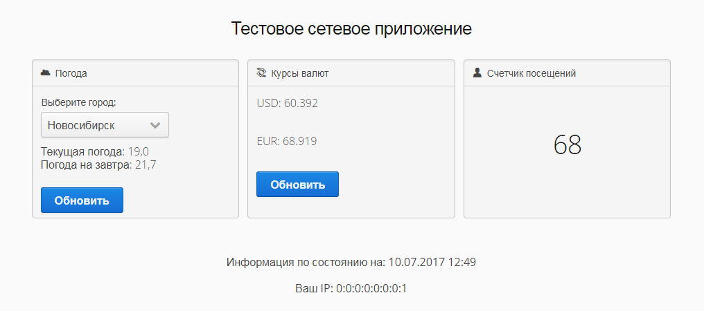

Написать примитивный сайт в стиле "дашборд" с использованием фреймворка vaadin (доступен по адресу https://vaadin.com/).

Клиентсткая часть сайта должен работать в основных десктопных и мобильных браузерах (Google Chrome, Firefox, Opera) - это обеспечивает фреймворк.
Серверная часть на ОС Linux (Ubuntu). Сервер приложений: tomcat8.

Вход на сайт без авторизации по http.

Выводиться должна следующая информация (см. вложение):

1. Текущую температуру и прогноз погоды на следующий день относительно текущего для нескольких городов России (пусть будет на выбор: Москва, Новосибирск, Санкт-Петербург). Информация о погоде должна быть получена через API публичных информеров. Любой на выбор и собственное усмотрение.

2. Текущие курсы валют: рубль/доллар, рубль/евро. Информация о курсах должна быть получена через API публичных информеров. Любой на выбор и собственное усмотрение.

3. Счётчик посещения данной страницы (дашборда), с сохранением значения между перезагрузками сервера. Счётчик хранить в БД mongo.

4. Текущая дата и время (серверные).

5. IP-Адрес клиента.

При нажатии кнопок "Обновить" - обновление соответствующей информации.

Прилагаю скетч страницы. Чёрно-белую цветовую гамму скетча соблюдать не нужно. Можно (и нужно) сделать дашборд максимально привлекательным и красивым. Расширение функционала по собственной инициативе приветствуется (например, прогресс-бар на время запросов и т.д.)

В случае отсутствия интернета или отказа API выдающего информацию о погоде или курсе валют, выводить в соответствующую область корректное сообщение о недоступности сервиса.

Для проверки должен быть предоставлен архив файлов для помещения в каталог tomcatX/webapps. Пакеты mongo-сервера будут установлены на проверочном хосте.
Также, для проверки, возможен хостинг данного "дашборда" на любой публичной площадке с возможностью удалённого входа.
Проект (исходники) необходимо вести в публичном репо GitHub.